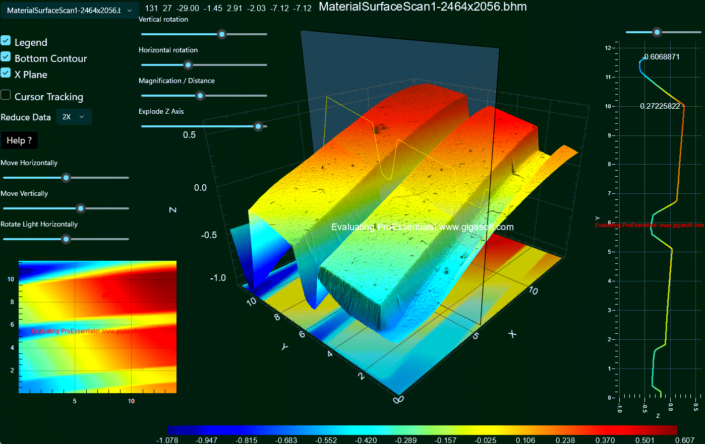

# GigaPrime3D — GPU Compute Shader 3D Surface Chart

Likely the most impressive functioning, performing, efficient 3d 2d combo example you will find on github.

A ProEssentials v11 WinUI .NET 10 demonstration of GPU compute shader 
3D surface rendering — real material surface and terrain height map 
data visualized across three synchronized charts.



---

> **Found ProEssentials through this repo?** Use code **GITHUB15_OCT31** at checkout for 15% off your first license.
>
> Thanks for sharing — every share and star helps another engineer find this repo.

---

## What This Demonstrates

GigaPrime3D showcases ProEssentials v11's most advanced rendering 
capabilities — a three-chart synchronized visualization of real 
scientific surface data including material surface measurements and 
terrain height maps.

### Three Synchronized Charts

| Chart | Type | Purpose |
|-------|------|---------|
| **Chart3DSurface** | Pe3doWinUI — 3D Surface | Main GPU-rendered 3D surface with lighting, rotation, zoom |
| **Chart2DContour** | PesgoWinUI — 2D Contour | Linked 2D top-down contour view — zoom here zooms the 3D chart |
| **Chart2DLine** | PesgoWinUI — 2D Cross Section | Live cross-section plane showing Y values at the X plane position |

---

## Key Technical Features

**GPU Compute Shader Surface Construction**
```csharp
// v11 new feature - builds the 3D scene on the GPU vs CPU
// 10x faster than v9 CPU-side construction
Chart3DSurface.PeData.ComputeShader = true;
```

**Zero Memory Copy — UseDataAtLocation**
```csharp
// Chart uses app memory directly — no data transfer overhead
// Same memory shared between Pe3doWinUI and PesgoWinUI
Chart3DSurface.PeData.X.UseDataAtLocation(sMyXData, _cols);
Chart3DSurface.PeData.Y.UseDataAtLocation(sMyYData, size);
Chart3DSurface.PeData.Z.UseDataAtLocation(sMyZData, _rows);
```

**Linked Chart Zoom**
Zooming or panning the 2D Contour chart automatically updates 
`ManualScaleControlX/Z` on the 3D surface chart — both views 
stay synchronized without any manual coordination.

**Pixel Shader Culling**
```csharp
Chart3DSurface.PeGrid.Configure.DxPsManualCullXZ = true;
```
Efficiently culls geometry outside the visible range on the GPU 
rather than CPU, maintaining performance during zoomed views.

**Data Reduction for Large Surfaces**
For height maps larger than 1000×1000, a configurable step value 
reduces data density for more responsive cursor tracking while 
maintaining visual fidelity.

---

## Data Files

GigaPrime3D includes real scientific surface data files in two 
formats:

- **`.bhm`** — Binary Height Map format. Header contains width, 
  height, min/max Z in mm. Data is a flat array of 4-byte floats.
- **`.png`** — PNG files read as raw pixel data for height values 
  rather than as images.

The `HeightMap` class handles both formats transparently, 
computing physical dimensions in millimeters from pixel dimensions 
and resolution.

---

## Interactive Controls — 3D Surface

- **Left-click drag** — rotate the surface
- **Shift + left-click drag** — translate/pan the scene
- **Mouse wheel** — zoom in and out
- **Middle button drag** — adjust light location
- **Right-click** — context menu including Cursor Tracking and 
  Undo Zoom
- **Height Map selector** — switch between included data files
- **Rotation sliders** — horizontal and vertical rotation control
- **Zoom slider** — zoom control
- **Z Exaggeration slider** — adjusts Z axis aspect ratio 
  (GPU-intensive, rebuilds triangle data)
- **Light rotation sliders** — vertical and horizontal light 
  position control
- **X Plane slider** — moves the cross-section plane, updates 
  the 2D line chart in real time
- **Cursor Tracking checkbox** — enables XYZ tooltip on mouse 
  hover (CPU-intensive for large surfaces — builds octree 
  data structure)
- **Reduce Data** — lowers data density for better cursor 
  tracking performance

## Interactive Controls — 2D Contour

- **Left-click drag** — zoom box, also zooms 3D surface
- **Right-click** — context menu with Undo Zoom

---

## Prerequisites

- Visual Studio 2026
- .NET 10 SDK
- Windows App SDK 2.2.0 (restored via NuGet on build)
- Internet connection for NuGet restore
- Dedicated GPU recommended for large data files

> **No XAML designer:** Visual Studio has no XAML designer for WinUI 3 
> in any edition, so the charts are declared in markup rather than 
> dragged from the Toolbox. That is a Windows App SDK limitation, not a 
> ProEssentials one. Nothing needs to be installed beyond the NuGet 
> packages for this project to build and run.

> **First load:** the largest height maps are 50-70 MB and the window 
> stays black for a second or so while they decode. That is expected.

---

## How to Run
```
1. Clone this repository
2. Open GigaPrime3DwinUI.sln in Visual Studio 2026
3. Build → Rebuild Solution (restores NuGet packages automatically)
4. Press F5
5. Select a height map file from the dropdown to load surface data
```

---

## NuGet Package

This project references 
[`ProEssentials.Chart.Net10.WinUI`](https://www.nuget.org/packages/ProEssentials.Chart.Net10.WinUI) 
from nuget.org. Package restore happens automatically on build.

The AnyCpu package embeds the native rendering engines inside the 
assembly and unpacks the one matching the running process at run time, 
so there is no native DLL to copy or deploy alongside your app. It also 
carries the control's `.pri`, whose resources are merged into your app's 
own `.pri` at build time.

The nuget.org package is the evaluation build and draws an "Evaluating 
ProEssentials" watermark across the chart. A licensed installation 
replaces the assembly and the watermark goes away — performance and 
behavior are identical.

---

## Deploying a WinUI App

WinUI deploys differently than WPF and WinForms:

- A .NET app is **not a single exe** — ship the entire build or publish 
  output folder, never a hand-picked subset.
- The target machine needs **two** runtimes: the .NET 10 Desktop Runtime 
  **and** the Windows App SDK Runtime. Or publish self-contained with 
  `-p:WindowsAppSDKSelfContained=true`.
- Your development machine already has both, so it will run from an 
  under-filled folder. Always validate on a clean machine.

---

## Related

- [3D Scientific Charts](https://gigasoft.com/why-proessentials/3d-scientific-charts)
- [Performance — GPU Architecture Comparison](https://gigasoft.com/why-proessentials/performance)
- [Gallery Data Visualization](https://gigasoft.com/wpf-chart-net-data-visualization)
- [No-hassle evaluation download](https://gigasoft.com/net-chart-component-wpf-winforms-download)
- [gigasoft.com](https://gigasoft.com)

---

## License

Example code is MIT licensed. ProEssentials requires a commercial 
license for continued use.

